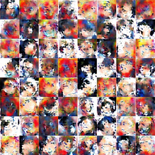

# Lazily building a smug anime face neural network for kicks

<p align="center">
    
</p>

> And if you gaze long into an abyss, the abyss also gazes into you.
> \- Friedrich Nietzsche

Summer vacation is a time to kickback, relax, and finally pursue passions now that school is finally over (at least for three months). Some people use the time to kayak, bike, or travel, but unfortunately for me I don't like getting wet, my bike is broken, and I don't have enough money to travel. I decided to spend the time working on some deep learning stuff to kill time.

A while back, in the happier, simpler times of 2017, I watched a Youtube video where some dude wanted to train a [neural network to create jazz](https://www.youtube.com/watch?v=nA3YOFUCn4U). I can't recall the exact details, but basically he converted musical scores into image "heatmaps," and used these pictures as training data. The neural network then spit out a generated heatmap, which he turned back into MIDI. Now, I'm not entirely sure if using images was the best method [(maybe this?)](http://web.mit.edu/music21/), but the idea of training a neural network to generate custom images interested me.

Back to the present day. I chose anime smug faces because I like my cartoons.

<p align="center">
    
</p>

In the summer heat, I didn't really feel like writing code, so I wanted to see if I could extend someone else's solution to just generate my cool pics. Fortunately, there are tons of open source projects out there implementing DCGAN, and I ultimately decided on [this one](https://github.com/carpedm20/DCGAN-tensorflow) because it had support for custom datasets already built in.

Now I just needed to collect my data, but where? Fortunately, there are a lot of weeaboos out there, and I managed to find [archives](https://github.com/Wigsinator/smugFaces) that people curate. I could always get more, though, and I found that there was a [subreddit dedicated entirely to smug](https://www.reddit.com/r/Smugs/). Downloading every image using ripme netted about 2k images. However, the problem with reddit (and internet communities in general) is that there are a *ton* of reposts and duplicated content. I needed a way to cut the fat.

Fortunately, fdupes came to the rescue! fdupes is a program by Adrián López that compares files in a directory and deletes duplicates. All I had to do was remove the metadata using exiftool, then use fdupes to remove repeated images.

This isn't a perfect solution, as some duplicate images aren't pixel perfect (JPEG artifacts, taking a picture of a may-may on your phone, etc.) but it managed to shrink my image set down to about 1200.

Unfortunately, my data gathering journey ended around here. I had a hard time finding any more original smug faces on the web, and I wasn't really willing to watch a ton of television just to get reaction images. This left me with an abysmally small sample size. For reference, the [NMIST dataset](http://yann.lecun.com/exdb/mnist/) contains around 70k images. I only have about 1k.

In cases like this, when you can't find enough data, you have to go make it. In order to generate more training data, I used imagemagick to apply a flip transformation and a blur filter. This quadrupled my dataset. If this dataset is too small, in the future I could apply more transformations or invert the colors. Each image modification process I could apply would essentially double the size of my dataset.

Now that I have enough images through all the modifications I applied, all I had to do was wait for the neural network to do its thing.

```
Epoch: [ 0/25] [   0/ 117] time: 189.3998, d_loss: 5.83379221, g_loss: 3.66512370
Epoch: [ 0/25] [   1/ 117] time: 368.7431, d_loss: 2.95546317, g_loss: 0.28795370
Epoch: [ 0/25] [   2/ 117] time: 541.4266, d_loss: 3.59594131, g_loss: 0.03459504
Epoch: [ 0/25] [   3/ 117] time: 714.3442, d_loss: 3.07951427, g_loss: 1.34468007
```

**TO BE CONTINUED?**
